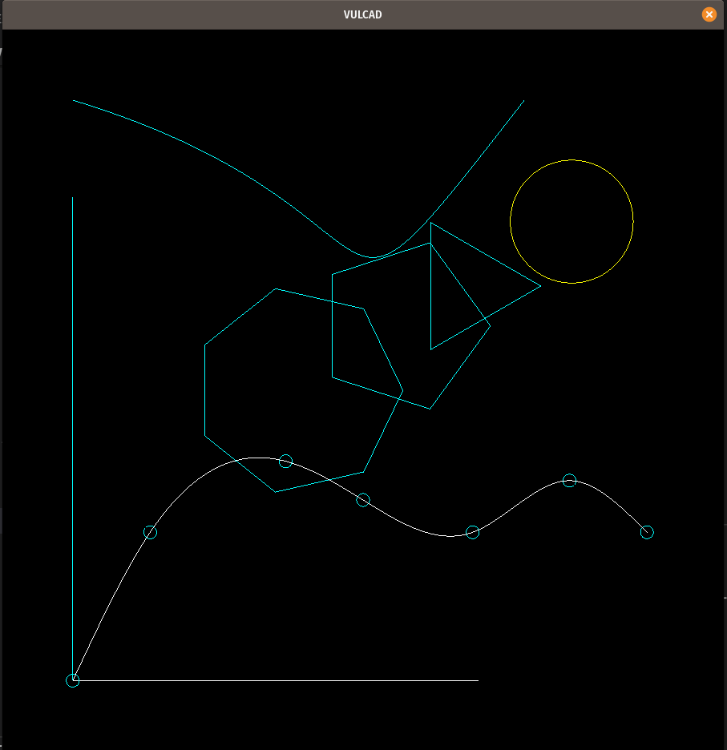

# A pattern making program

2D CAD for pattern making written in Rust with vulkan

## Features

- supported shapes
  - line
  - point
  - circle and any polygons
  - bezier curve
  - spline and any polylines
- cross platform
- save drawings as dxf files (Drawing Exchange Format. the most common file format for CAD applications)
- matrix and vector calculations

## Pros

Using WebAssembly, the program runs on the both of browser and desktop

- run `cargo run --example main` to start on desktop
- run `cd clothes && wasm-pack build --target web` to build for browser

## Roadmap

- [x] render vertices
- [x] change units in centimeter
- [x] draw lines
- [x] draw circles

  ~~export as dxf ([sample](dxf))~~ **in favor of use of printers with real sized PDF, but may be implemented in future to use drawings with laser cutters**

- [x] export as pdf ([sample](clothes/out/base.pdf))

  ~~draw spline~~ **in favor of ARBITRARY DIMENSIONS bezier curve dependent on FIT POINTS, not ctrl points**

- [x] draw bezier curves
- [] create base pattern
- [] create black shirts
- [] create gray jeans
- [] create black round tyrolean

  ~~zoom~~ lack of time and low priority

  ~~pan~~ lack of time and low priority

- [] documentation

## Disclaimer

- No user interface
